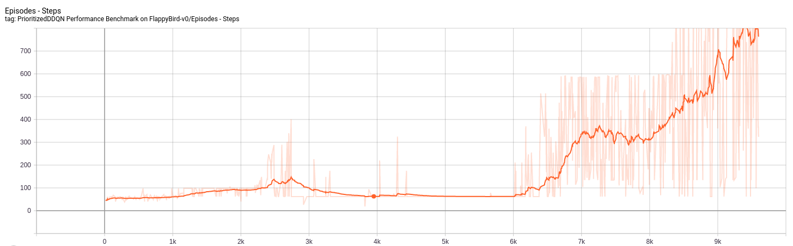

# Symbiosis
A Reinforcement Learning library for solving custom environments 

#### Installation steps
```bash
(symbiosis) poetry install
```

#### Invoking <i>Chess-v0</i> <i>AlphaGo Zero</i> agent
```bash
(symbiosis) poetry run python3.6 -m chess_bot
```

#### Invoking <i>FlappyBird-v0</i> <i>DQN</i> agent
```bash
(symbiosis) poetry run python3.6 -m flappy_bird_bot
```

#### Invoking <i>FlappyBird-v0</i> <i>DQN</i> agent with <i>Gunnar-Farneback</i> reward model
```bash
(symbiosis) poetry run python3.6 -m flappy_bird_with_gunnar_farneback_bot
```

#### Visualization of <i>DQN</i> performance on <i>FlappyBird</i>
##### peformance with implicit rewards
```bash
(FlappyBird-v0) tensorboard --logdir .
```
##### peformance with <i>Gunnar-Farneback</i> reward model
```bash
(FlappyBirdGunnarFarneback-v0) tensorboard --logdir .
```

### Discrete Agents
Flappy Bird             |  Enduro
:-------------------------:|:-------------------------:
  |  

Flappy Bird             |  Enduro
:-------------------------:|:-------------------------:
  |  
